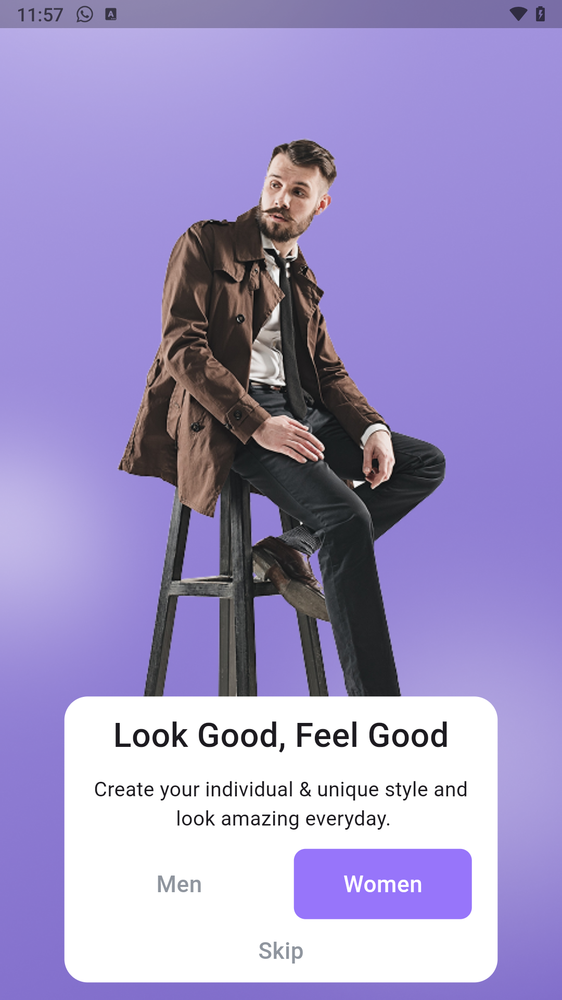
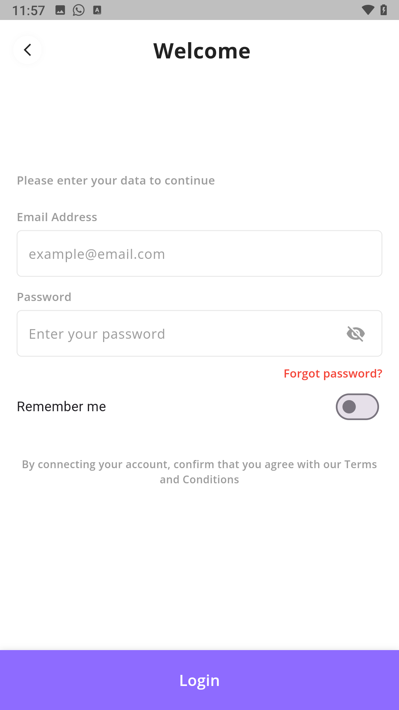
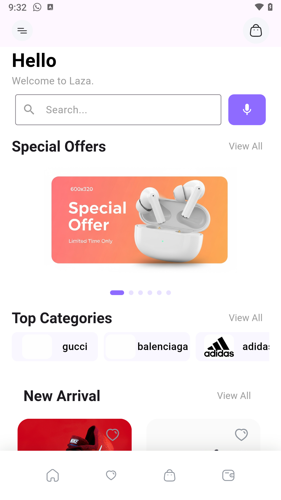
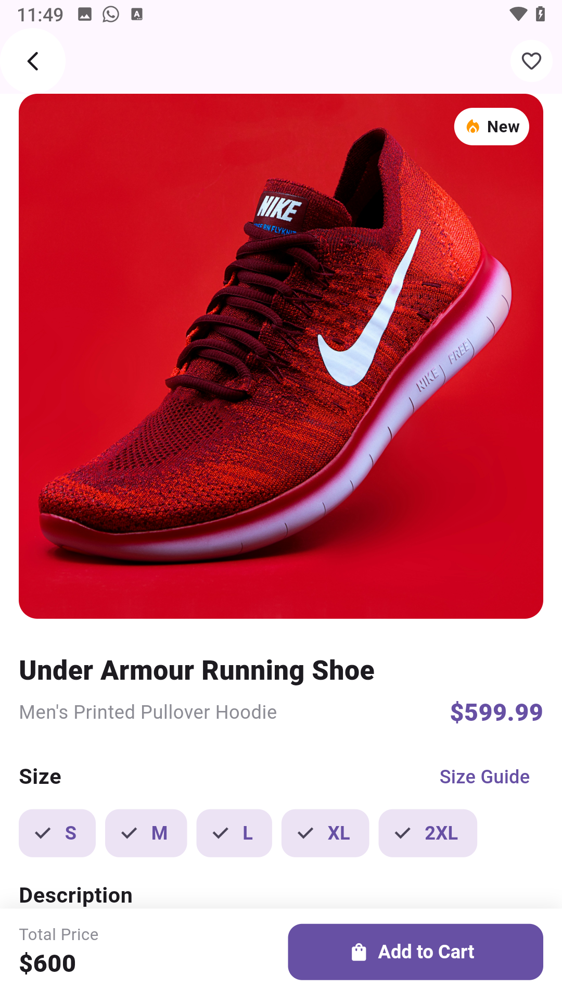
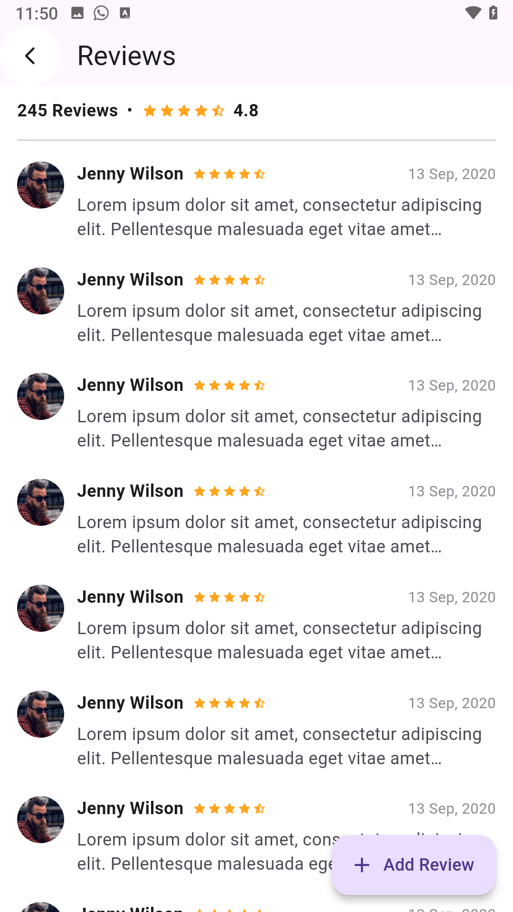

# 🛍️ Flutter E-Commerce App

A modern **E-Commerce mobile application** built with **Flutter** 🐦, applying **Clean Architecture**, **Cubit (BLoC)** state management, **Dio + Retrofit** networking, and **robust API error handling**.

This app provides a smooth shopping experience — from authentication to browsing products, viewing details, managing the cart, and checking reviews.

---

## ✨ Overview

This project demonstrates a **scalable and maintainable architecture** following the principles of **Clean Architecture** 🧱 and **Separation of Concerns**.  
It’s designed to be **easy to extend**, **test**, and **maintain**.

---

## 🏗️ Folder Structure & Clean Architecture Explanation

---

### 🧩 Clean Architecture Layers
- **Data Layer:**  
  Contains models, DTOs, API services, and repository implementations that fetch or persist data.  
  (e.g. using Dio + Retrofit for networking)
  
- **Domain Layer:**  
  The **core business logic** — independent from Flutter.  
  Includes **entities** and **use cases (interactors)** that define app rules.
  
- **Presentation Layer:**  
  Responsible for **UI** and **state management** using **Cubit (Bloc)**.  
  It reacts to state changes and displays the appropriate widgets.

✅ **Benefits:**
- Reusable and testable code  
- Easy maintenance  
- Flexible and scalable for future features  

---

## 🚀 Features

- 🔐 **Authentication**  
  - Login, Register, and Verify Account screens  

- 🏠 **Home Page**  
  - Dynamic **Offers**, **Categories**, and **Product** listing  

- 🛒 **Cart Management**  
  - Add / Remove items  
  - Display total and checkout summary  

- ⭐ **Product Details**  
  - View product info, price, and description  

- 💬 **Reviews Page**  
  - List of user reviews  

- ⚙️ **Clean Architecture + Cubit + Retrofit + Dio**  
  - Robust error handling  
  - Clear separation of layers  

---

## 🖼️ Screenshots

| Splash | OnBoarding | Login | Home | Details | Reviews |
|:------:|:-----------:|:-----:|:----:|:--------:|:--------:|
|  |  |  |  |  |  |


## 🎥 Demo

> 📱 *Coming soon...*  

---

## 🧑‍💻 How to Run the App

### 🧱 Requirements
- **Flutter SDK:** 3.32.0  
- **Dart SDK:** 3.8.0  
- **Android Studio** or **VS Code**

### ⚙️ Setup

1. **Clone the repository**
   ```bash
   git clone https://github.com/yourusername/flutter_ecommerce_app.git
   cd flutter_ecommerce_app

2. **Install dependencies**
  ```bash
   flutter pub get
  ```
3. **Run The app**
  ```bash
   flutter run
  ```

4. **Generate Retrofit files**
  ```bash
    flutter pub run build_runner build --delete-conflicting-outputs
  ```

--- 

### 🧠 Tech Stack

| Category                 | Technology           |
| ------------------------ | -------------------- |
| **Framework**            | Flutter 3.32.0       |
| **Language**             | Dart 3.8.0           |
| **State Management**     | Cubit (Bloc)         |
| **Networking**           | Dio + Retrofit       |
| **Architecture**         | Clean Architecture   |
| **Dependency Injection** | get_it / injectable  |
| **Error Handling**       | Custom APIErrorModel |
| **Routing**              | AppRouter            |

---

## 👨‍💻 Author  

**Israa Essa**  
💼 Mobile Application Developer

🌐 Portfolio: [https://www.linkedin.com/in/israa-essa-3b5644384]  

💻 GitHub: [Israa050]  

---

### 🧾 License

This project is licensed under the MIT License.

